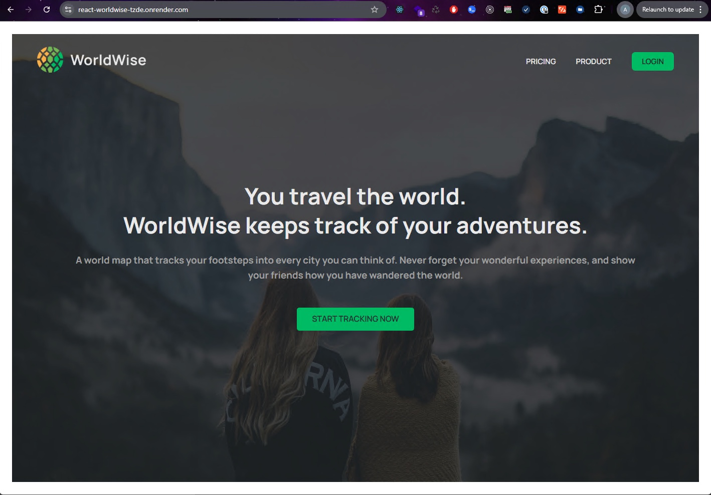
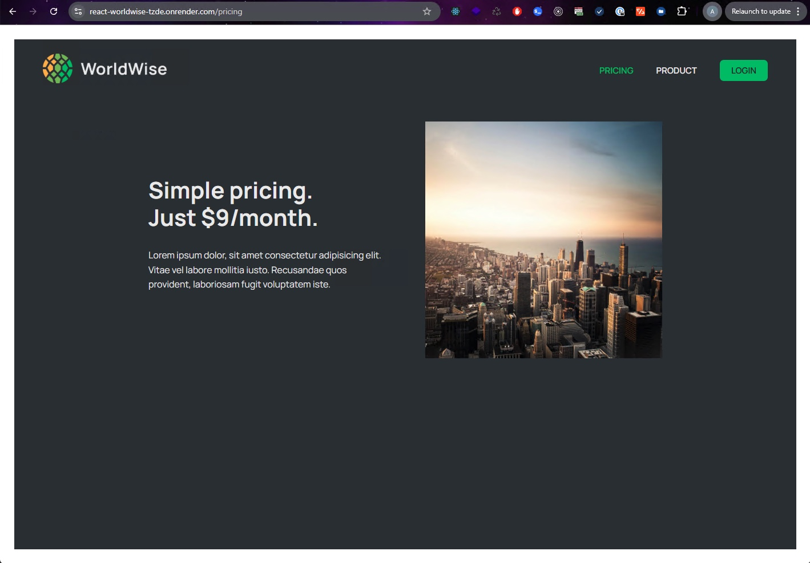
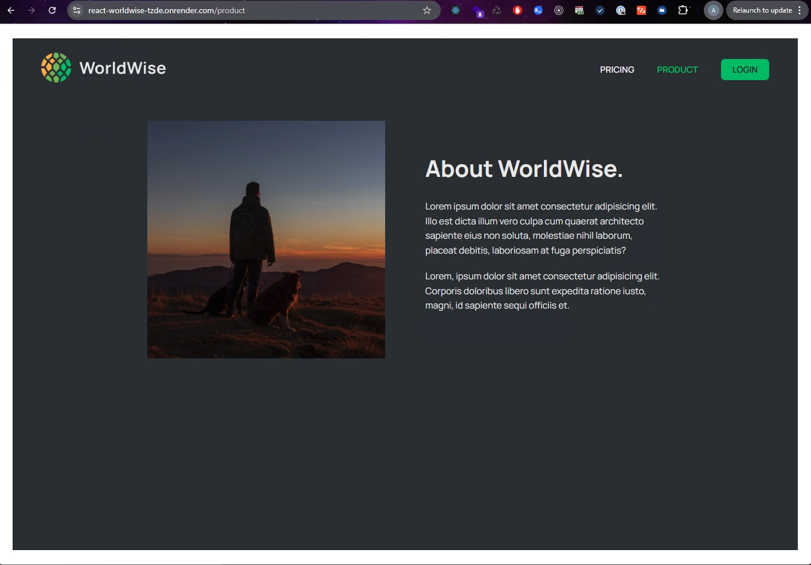
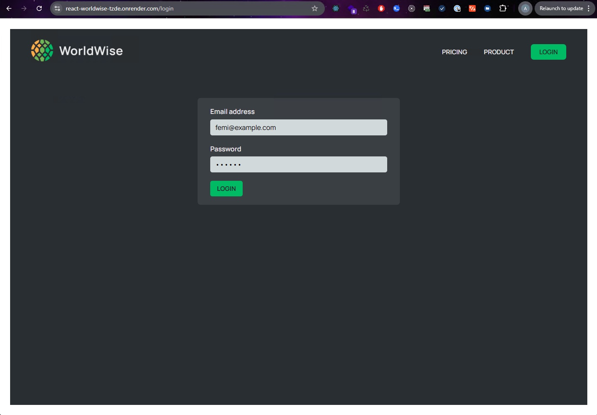
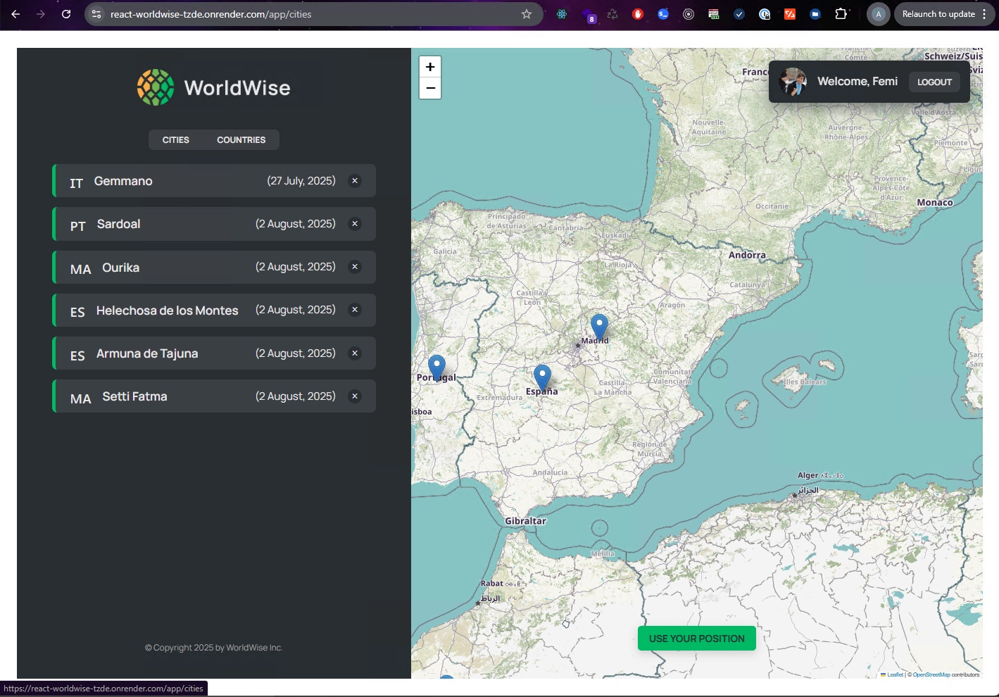
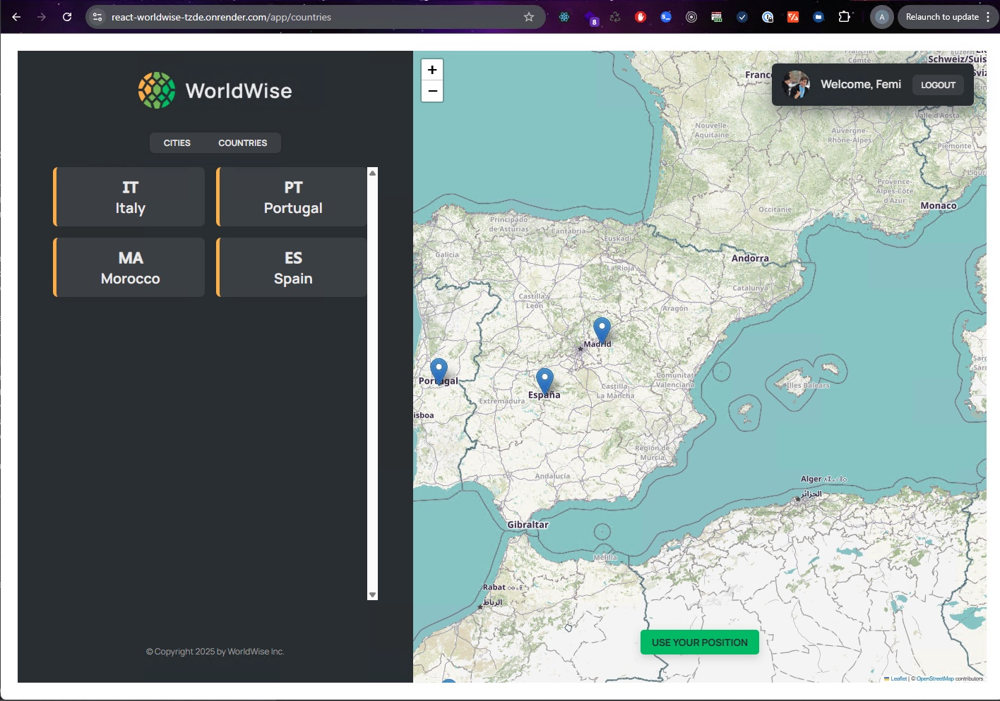
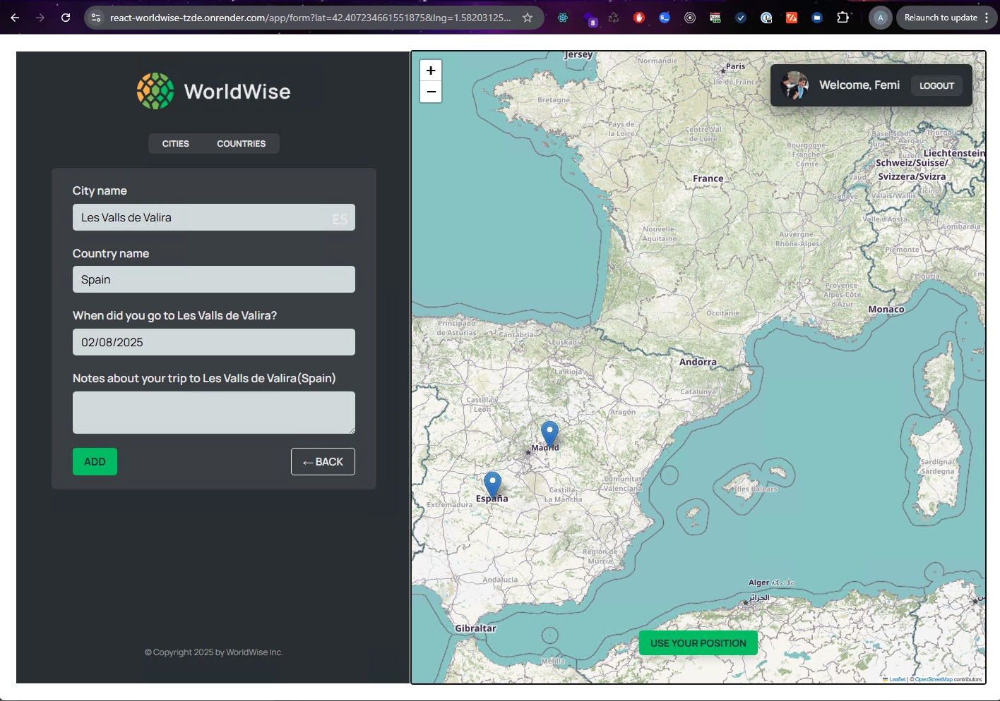
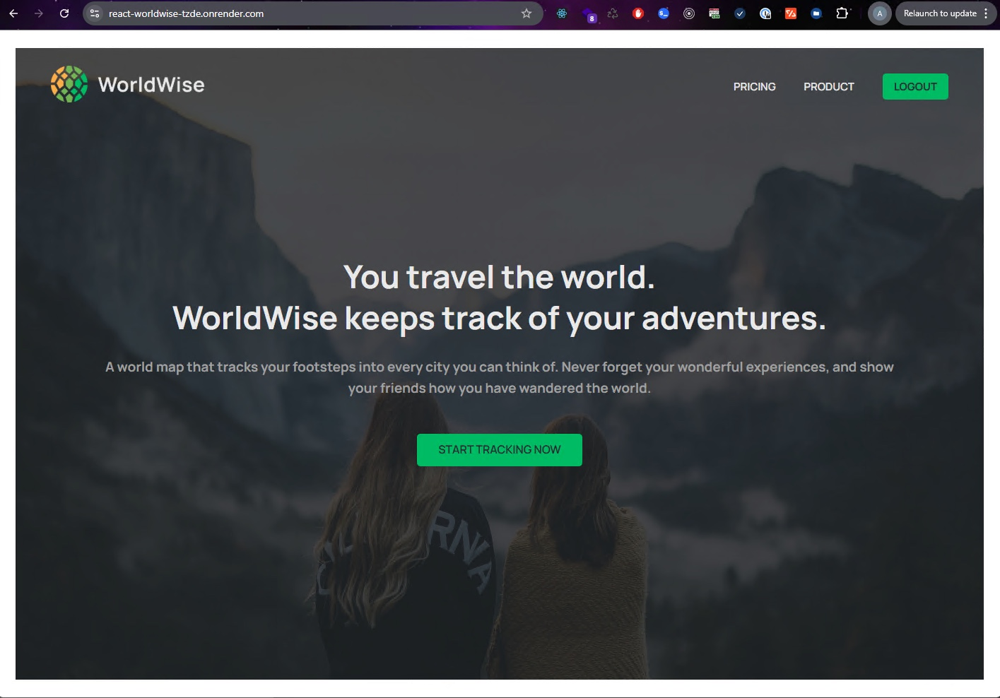
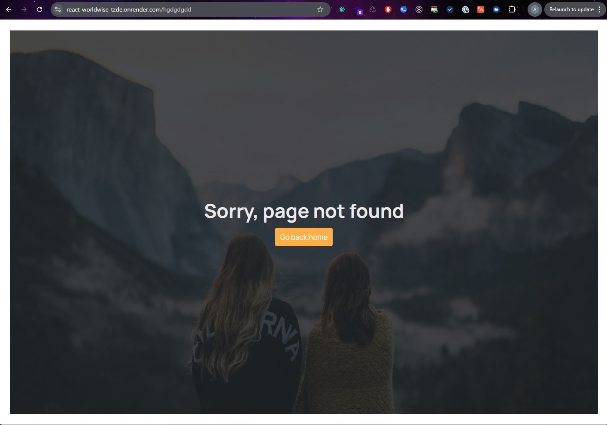

# 🌍 WorldWise React App

WorldWise is a location-tracking travel journal app built with React. It allows users to view cities and countries, and add new locations using a simple form. The app supports reverse geocoding to convert coordinates into city and country names using the BigDataCloud API.
Authentication and route protection are managed using a mock auth system. The app is styled with CSS Modules for scoped styling and uses lazy loading with Suspense to improve performance.
A mock backend is provided using JSON Server, which serves and persists city data locally. The entire app is deployed on Render, enabling live access to all features in production.

## 🔗 Live Demo

https://react-worldwise-tzde.onrender.com

## 📦 Features

- 🔐 Protected routes with fake authentication
- 🌍 City and country list management with context
- 📄 Custom hooks for geolocation and URL parsing
- 🏙️ Add a city to your travel log with notes, country info, and visit date
- 📥 Lazy loading of pages for faster performance
- 🌐 Reverse geocoding using BigDataCloud API to fetch city and country details from coordinates
- 🧭 Routing with React Router DOM
- 🗺️ Map visualization using react-leaflet
- 🧪 JSON Server for mocking backend API
- 🎨 CSS Modules for scoped styling

## 🚀 Tech Stack

- Frontend: React, Vite
- Routing: React Router DOM v6
- Styling: CSS Modules
- State Management: React Context API
- Map Integration: Leaflet with React Leaflet
- Backend (Mock): JSON Server
- Deployment: Render

## 💻 Using the application on your local system

- Clone the repository : git clone https://github.com/lumidee007/worldwise
- Change directory: cd worldwise
- Install dependencies : npm install
- Start the mock API server: npm run server
- Start the development server: npm run dev
- Build for production : npm run build

## 🧩 Routing Summary

- / – Homepage
- /pricing – Pricing page
- /product – Product info
- /login – Login page
- /app – Protected route
  - /app/cities – List of cities
  - /app/cities/:id – City detail
  - /app/countries – List of countries
  - /app/form – Add new entry
- /\* - Page Not Found
